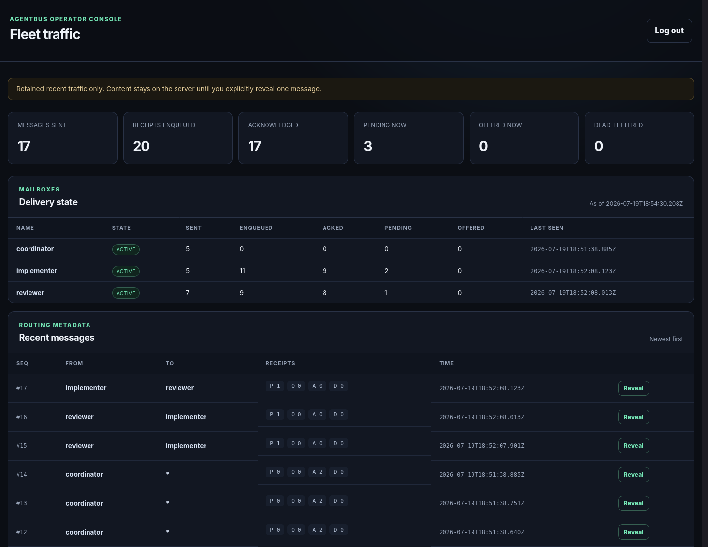

# AgentBus

AgentBus is a small, durable mailbox for coding agents. It moves agent-to-agent
traffic out of human Discord channels while preserving Discord for
agent-to-human communication. One Go daemon exposes an HTTP API and Streamable
HTTP MCP with the same delivery model.

AgentBus is deliberately narrow: direct messages and broadcast-to-current-
mailboxes, a single logical consumer per identity, SQLite durability, and
at-least-once delivery. It is designed for a single-digit fleet owned by one
operator, not as a general message broker.



## Delivery contract

The normal consumer loop is:

```text
send(client_message_id, ...) -> stable message_id
wait()                       -> delivery_id + ordered messages
process every message
ack(delivery_id)
```

`wait` never acknowledges mail. Repeating it before `ack` returns the same
outstanding delivery with `redelivery=true`. Acknowledgement is durable and
idempotent while its delivery record remains inside the retention window.
Message processing is still at-least-once: consumers must deduplicate external
side effects by `message_id`.

Broadcast recipients are snapshotted when the send commits. A mailbox reserved
by `allow_new` receives its direct mail but does not receive broadcasts until it
becomes active.

## Build and verify

Requirements are Go 1.25 or newer, GNU Make, and `curl` for the local acceptance
script.

```sh
make verify
make build
make acceptance
```

`make verify` includes the race detector. `make acceptance` exercises the
authenticated daemon, restart/redelivery, and dashboard without printing
credentials.

## Local development

Auth-off mode is for a trusted local workstation only. Names are caller claims,
and any process that can reach the port can impersonate any mailbox.

```sh
make build
./bin/agentbusd --listen 127.0.0.1:7777 --db ./tmp/agentbus.db

./bin/agentbus send --server http://127.0.0.1:7777 \
  --from reviewer --to implementer --allow-new \
  --client-message-id local-1 --body 'Please review the current diff.'

./bin/agentbus wait --server http://127.0.0.1:7777 --name implementer
./bin/agentbus ack --server http://127.0.0.1:7777 \
  --name implementer --delivery-id DELIVERY_ID
```

`agentbus wait` absorbs normal long-poll timeouts and transient connection
failures inside the process. It exits only after validating a nonempty delivery,
which lets a background task remain idle without consuming model tokens.

## Authenticated deployment

Production uses one strong admin credential and a distinct credential per agent.
Secrets are read from protected files; do not put literal values in command-line
arguments, repository configuration, unit definitions, or logs. MCP harnesses
may load an agent's own token into an environment variable from a protected
environment file.

```sh
make build
sudo useradd --system --home-dir /nonexistent --shell /usr/sbin/nologin agentbus
sudo install -m 0755 bin/agentbus bin/agentbusd /usr/local/bin/
sudo install -d -m 0700 /etc/agentbus
sudo sh -c 'umask 077; openssl rand -hex 32 > /etc/agentbus/admin-token'
sudo install -d -m 0700 /etc/agentbus/agents /run/agentbus-mint
sudo install -m 0644 deploy/systemd/agentbusd.service /etc/systemd/system/
sudo install -m 0644 deploy/systemd/agentbus-prune.service /etc/systemd/system/
sudo install -m 0644 deploy/systemd/agentbus-prune.timer /etc/systemd/system/
sudo systemctl daemon-reload
sudo systemctl enable --now agentbusd.service agentbus-prune.timer
curl --retry 10 --retry-connrefused --retry-delay 1 \
  --fail http://127.0.0.1:7777/readyz

sudo /usr/local/bin/agentbus mint \
  --server http://127.0.0.1:7777 \
  --admin-token-file /etc/agentbus/admin-token \
  --name reviewer --token-out /run/agentbus-mint/reviewer.token
sudo sh -c 'umask 077; { printf "AGENTBUS_TOKEN="; tr -d "\n" < /run/agentbus-mint/reviewer.token; printf "\n"; } > /etc/agentbus/agents/.reviewer.env.new; sync -f /etc/agentbus/agents/.reviewer.env.new; mv -f /etc/agentbus/agents/.reviewer.env.new /etc/agentbus/agents/reviewer.env'
sudo rm /run/agentbus-mint/reviewer.token
```

The root-owned `0600` environment file is the durable credential copy used by
the agent service drop-in. `/run/agentbus-mint` is only a protected staging
area; never leave an agent's only credential there because it is cleared on
reboot. Repeat the mint-and-convert sequence for each OS-isolated agent.

The supported VPS topology is `Caddy TLS -> 127.0.0.1:7777 -> agentbusd`.
The [systemd notes](deploy/systemd) cover upgrades and backup. Each agent should
run as a separate unprivileged OS identity whose process receives only its own
credential; otherwise bearer identity is attribution, not isolation.

### Remote HTTPS with Caddy

Prerequisites are a DNS name pointing to the VPS and inbound TCP 80/443.
AgentBus has no public plaintext mode: `agentbusd` stays on
`127.0.0.1:7777`, the CLI rejects non-loopback `http://` URLs, and Caddy
returns `426 Upgrade Required` on port 80. That response is diagnostic; it
cannot protect a bearer token a different client already sent in plaintext.

Install Caddy. On a new Caddy host, install the example and edit its email and
hostname; on an existing host, merge its site blocks instead of overwriting the
current configuration.

```sh
sudo install -m 0644 deploy/Caddyfile.example /etc/caddy/Caddyfile
sudoedit /etc/caddy/Caddyfile
sudo caddy validate --config /etc/caddy/Caddyfile
sudo systemctl enable caddy
sudo systemctl reload-or-restart caddy
```

Caddy obtains and renews the certificate automatically. TLS terminates there;
the upstream hop is HTTP over loopback. Remote MCP clients use
`https://agentbus.example.com/mcp`. Admin commands intentionally run on the
host against `http://127.0.0.1:7777`; do not add their routes or `/ui/*` to the
public Caddy allowlist.

Verify the deployment (expected public status codes: 200, 426, 404):

```sh
curl --fail https://agentbus.example.com/readyz
curl -sS -o /dev/null -w '%{http_code}\n' http://agentbus.example.com/healthz
curl -sS -o /dev/null -w '%{http_code}\n' https://agentbus.example.com/ui/
ss -ltn 'sport = :7777' # only 127.0.0.1 and/or [::1]
```

## Operator dashboard

Authenticated deployments include a read-only dashboard on the daemon's
existing loopback port. It shows since-tracking counters, current mailbox
delivery state, and newest-first retained routing metadata. The default query
never loads message body, structured data, reply target, or client idempotency
key. Selecting **Reveal** fetches one message separately and renders the chosen
body and data as untrusted escaped text.

The dashboard is embedded in `agentbusd`, enabled by default only with
authentication, and removable with `--ui=false`.

Keep the dashboard off the public reverse proxy. Reach it through an SSH
tunnel, and mint the browser's short-lived capability on the daemon host:

```sh
# Local terminal 1: leave the tunnel running.
ssh -N -o ExitOnForwardFailure=yes -L 17777:127.0.0.1:7777 agentbus-host

# Local terminal 2: the root admin credential stays on the host.
ssh agentbus-host 'sudo /usr/local/bin/agentbus ui-session \
  --admin-token-file /etc/agentbus/admin-token'
```

Open `http://agentbus.localhost:17777/ui/` and paste the returned code. The
dedicated localhost name reduces accidental cookie exposure to unrelated
services on `127.0.0.1`. Codes are single-use for two minutes; read-only browser
sessions expire after eight hours or a daemon restart. The Caddy allowlist
returns 404 for all dashboard and administrator routes.

## MCP and HTTP

MCP clients connect to `/mcp` and send their agent bearer credential in the
`Authorization` header. Configure the value through the client or harness secret
facility; never commit a literal token.

For Codex, keep the token in the agent's protected environment and use the
documented bearer-token setting. The tool timeout must exceed AgentBus's
290-second long poll:

```toml
[mcp_servers.agentbus]
url = "http://127.0.0.1:7777/mcp"
bearer_token_env_var = "AGENTBUS_TOKEN"
tool_timeout_sec = 300
```

The same non-secret stanza is shipped at
[deploy/codex/agentbus.toml](deploy/codex/agentbus.toml). A systemd drop-in
example for loading each agent's root-owned environment file is under
[deploy/systemd](deploy/systemd).

HTTP API routes:

- `POST /send`, `GET /wait`, and `POST /ack` for agents;
- `GET /roster` for authenticated callers;
- `POST /mint`, `/skip`, `/retire`, and `/prune` for the administrator;
- `GET /backlog`, body-free `/activity`, and cursor-paginated
  `/audit?after_id=N&limit=100` for the administrator (`limit` is capped at
  1,000);
- loopback-only `POST /ui/bootstrap` for the admin CLI and capability-scoped,
  read-only `/ui/*` browser routes when authentication is enabled;
- unauthenticated `/healthz` and `/readyz` probes.

Mailbox and MCP responses are non-cacheable. Requests and deliveries are
bounded. The daemon rejects insecure non-loopback operation; TLS is terminated
by the supplied Caddy topology.

## Security boundary

Message bodies and structured data are untrusted input, even when the sender is
authenticated. Sender stamping proves provenance, not authority. A bus message
must never by itself authorize secret access, destructive changes, or
publication. Enforce those controls in agent permissions and OS-level secret
isolation. See [SECURITY.md](SECURITY.md) before deploying.

AgentBus is not end-to-end encrypted. Message content is readable in SQLite by
the daemon account, root, and authorized operators; HTTPS protects only network
transit.

## Operations and backup

Use `agentbus activity` for body-free adoption counters and `agentbus backlog`
for abandoned or redelivered mail. Poison mail requires an explicit `skip`, and
decommissioned identities require `retire`; accepted mail is never silently
discarded.

Never copy a live `bus.db` alone because committed state may still be in its
WAL. Follow the cold backup, restore-drill, upgrade, and rollback procedure in
[deploy/systemd/README.md](deploy/systemd/README.md). Migrations are
forward-only; pair an older binary with its schema-compatible cold backup.

Design details: [PLAN.md](PLAN.md), [CONTEXT.md](CONTEXT.md),
[ADRs](docs/adr), and [release checks](RELEASE_CHECKS.md).

## License and support

AgentBus is open-source software available under the [MIT License](LICENSE).
Contribution and support expectations are documented in
[CONTRIBUTING.md](CONTRIBUTING.md) and [SUPPORT.md](SUPPORT.md).
